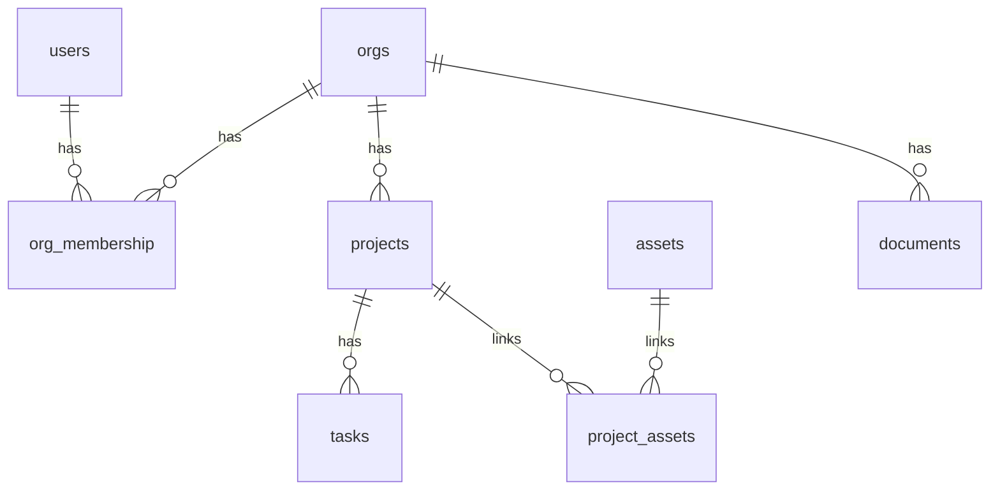

## The Example App

Every example on this page uses the same app. It has organizations, projects, tasks, assets, and documents.

Here is how the tables relate:

- A user belongs to one or more organizations. The `org_membership` table links a `user_id` to an `org_id`.
- Each project belongs to one organization through `org_id`. Each project also has a plain text `region` column such as `us-east`.
- Each task belongs to one project through `project_id`.
- Projects and assets link through the `project_assets` table.
- Each document has an `owner_id`, a `shared_with` user, and an `org_id`.
- The `categories` table is shared reference data. It has no owner and no links to the other tables, so it does not appear in the diagram above.
