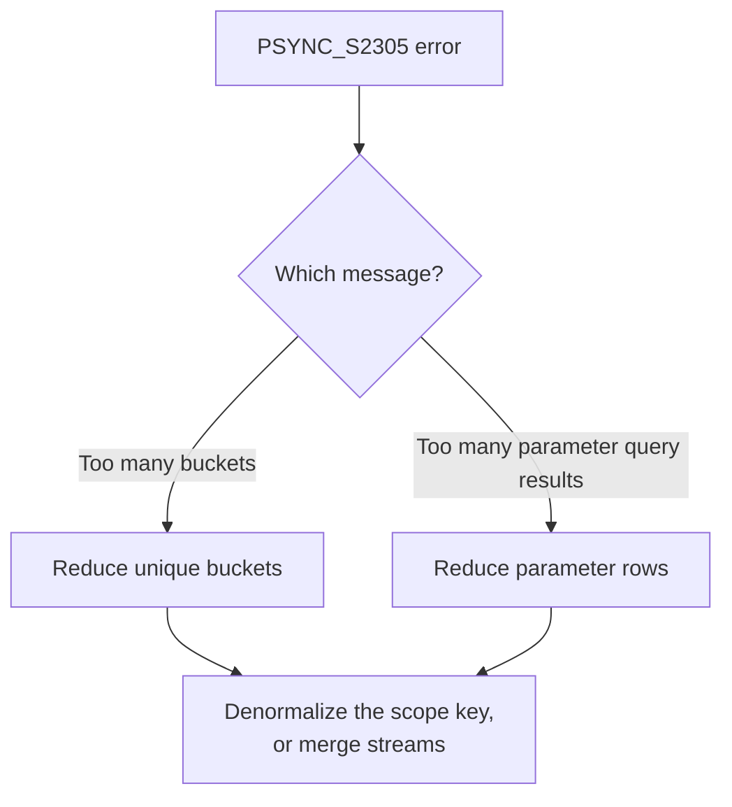

import BucketCountExampleApp from '/snippets/bucket-count-example-app.mdx';

If a user syncs too many buckets, or you hit a `PSYNC_S2305` error, this page shows how to find the cause and bring the count down. For how buckets are counted in the first place, see [Bucket Count](/sync/streams/bucket-count).

PowerSync enforces two limits per user, both with a default of 1,000. One is the number of unique buckets. The other is the number of parameter query results, counted before duplicates are removed. Exceeding either fails the sync with a `PSYNC_S2305` error. The fix is different for each, so start by finding out which one you hit from the error message. See [Limits](/sync/streams/bucket-count#limits) for the full difference.

## Diagnosing High Bucket Count

### Reading the Error Message First

The `PSYNC_S2305` message tells you which limit you reached. The fix is different for each, so read it first.

- `Too many buckets` means you reached the bucket limit. Reduce the number of unique buckets. Any strategy below helps.
- `Too many parameter query results` means you reached the parameter limit. Reduce the rows your parameter lookups return. Only some strategies help here: [Denormalizing the Scope Key](#denormalizing-the-scope-key) and [Querying the Membership Table Directly](#querying-the-membership-table-directly) cut the lookups themselves, so they lower both counts.



### The Contributor Breakdown

The `PSYNC_S2305` log includes a breakdown of the streams that contribute the most.

- For a bucket-limit error, it lists streams by bucket count, highest first.
- For a parameter-limit error, it lists the streams that returned the most rows, and then the stream that exceeded the limit. Each listed stream shows how many rows it returned. The failing stream instead shows how much budget was left when it failed.

<Warning>
For a parameter-limit error, the last stream in the breakdown is the one that ran when the limit was reached. This stream is not always the cause. PowerSync adds up parameter results across streams in order. The last stream is only the one that exceeded the limit. Check every stream in the breakdown, not just the last one.
</Warning>

### Checkpoint Logs

Checkpoint logs record the counts for each connection. Find them in your [instance logs](/maintenance-ops/monitoring-and-alerting). For example:

```text
New checkpoint: 800178 | write: null | buckets: 7 | param_results: 6 ["5#org_data|0[\"ef718ff3...\"]","5#org_data|1[\"1ddeddba...\"]", ...]
```

- `buckets` is the number of unique buckets for this connection.
- `param_results` is the total number of parameter rows for this connection.
- The array lists the bucket names. Each name already includes its parameter value. The list stops after 20 names.

### Sync Diagnostics Client

The [Sync Diagnostics Client](/tools/diagnostics-client) shows the buckets for one user. It does not load for a user who is over the limit, because that user's sync fails before the data loads. Use the instance logs and the error breakdown for those users. The client shows the bucket count, which may not be the limit you reached. Confirm the limit from the error message.

<BucketCountExampleApp />

## Reducing Bucket Count

Start with the strategy that matches your query pattern. Most high counts come from hierarchical or many-to-many data, where denormalizing the scope key gives the biggest reduction.

### Multiple Queries per Stream

**Reduces:** bucket count.

Use `queries` instead of separate streams to group related tables. All queries in a stream that filter the same way share one bucket per value. See [multiple queries per stream](/sync/streams/queries#multiple-queries-per-stream).

**Before**: 5 separate streams, each with a direct `auth.user_id()` filter, create 5 buckets per user.

**After**: 1 stream with 5 queries creates 1 bucket per user.

```yaml
streams:
  user_settings: # [!code --]
    query: SELECT * FROM settings WHERE user_id = auth.user_id() # [!code --]
  user_prefs: # [!code --]
    query: SELECT * FROM preferences WHERE user_id = auth.user_id() # [!code --]
  user_org_list: # [!code --]
    query: SELECT * FROM org_membership WHERE user_id = auth.user_id() # [!code --]
  user_region: # [!code --]
    query: SELECT * FROM region_members WHERE user_id = auth.user_id() # [!code --]
  user_profile: # [!code --]
    query: SELECT * FROM profiles WHERE user_id = auth.user_id() # [!code --]
  user_data: # [!code ++]
    queries: # [!code ++]
      - SELECT * FROM settings WHERE user_id = auth.user_id() # [!code ++]
      - SELECT * FROM preferences WHERE user_id = auth.user_id() # [!code ++]
      - SELECT * FROM org_membership WHERE user_id = auth.user_id() # [!code ++]
      - SELECT * FROM region_members WHERE user_id = auth.user_id() # [!code ++]
      - SELECT * FROM profiles WHERE user_id = auth.user_id() # [!code ++]
```

### Denormalizing the Scope Key

**Reduces:** bucket count and parameter query results.

This is the most effective fix for parent-child data. When chained queries through org → project → task create too many buckets, filter every table with the same top-level parameter, such as `org_id`. A bucket's key must be a column on the table you sync (see [The Partition Key Must Exist on the Row](#the-partition-key-must-exist-on-the-row) below). So this works only if the child tables have that column. If tasks only have `project_id`, add `org_id` to the tasks table.

**Before**: chained queries create 10 + 500 = 510 buckets for 10 orgs with 50 projects each. Projects and tasks share buckets because they use the same filter. Orgs use a different filter, so they add their own buckets.

**After**: add `org_id` to the tasks table, drop the `user_projects` CTE, and filter every table by org. This creates 10 buckets.

```yaml
streams:
  org_projects_tasks:
    with:
      user_orgs: SELECT org_id FROM org_membership WHERE user_id = auth.user_id()
      user_projects: SELECT id FROM projects WHERE org_id IN (SELECT org_id FROM org_membership WHERE user_id = auth.user_id()) # [!code --]
    queries:
      - SELECT * FROM orgs WHERE id IN user_orgs
      - SELECT * FROM projects WHERE id IN user_projects # [!code --]
      - SELECT * FROM projects WHERE org_id IN user_orgs # [!code ++]
      - SELECT * FROM tasks WHERE project_id IN user_projects # [!code --]
      - SELECT * FROM tasks WHERE org_id IN user_orgs # [!code ++]
```

### Querying the Membership Table Directly

**Reduces:** bucket count and parameter query results.

When a subquery or JOIN through a membership table creates N buckets, query the membership table directly with a direct auth filter. Use no subquery and no JOIN. You often need fields from the related table, such as the org name, alongside each membership row. Denormalize those fields onto the membership table so they are available without a JOIN.

**Before**: N org memberships create N buckets.

**After**: 1 bucket per user, with org fields denormalized onto `org_membership`.

```yaml
streams:
  org_data: # [!code --]
    query: SELECT * FROM orgs WHERE id IN (SELECT org_id FROM org_membership WHERE user_id = auth.user_id()) # [!code --]
  my_org_memberships: # [!code ++]
    query: SELECT * FROM org_membership WHERE user_id = auth.user_id() # [!code ++]
```

### Many-to-Many via a JSON Array Column

**Reduces:** bucket count.

A join through a link table creates one bucket per row of the table you select from. For assets linked to projects through `project_assets`, you get one bucket per asset.

Add a denormalized `project_ids` JSON array column to `assets`, maintained with database triggers. Then use `json_each()` to traverse it. This lets PowerSync key the bucket by project ID instead of asset ID.

**Before**: one bucket per asset. 2,000 assets create 2,000 buckets.

**After**: key by project. 50 projects create 50 buckets.

```yaml
streams:
  assets_in_projects:
    with:
      user_projects: SELECT id FROM projects WHERE org_id IN (SELECT org_id FROM org_membership WHERE user_id = auth.user_id())
    query: SELECT assets.* FROM assets JOIN project_assets ON project_assets.asset_id = assets.id WHERE project_assets.project_id IN user_projects # [!code --]
    query: SELECT assets.* FROM assets INNER JOIN json_each(assets.project_ids) AS p INNER JOIN user_projects ON p.value = user_projects.id # [!code ++]
```

The `INNER JOIN user_projects` syncs only assets that belong to at least one of the user's projects. The bucket key is the project ID, so the count matches the number of projects, not assets.

### Subscription Parameters for On-Demand Sync

**Reduces:** bucket count.

Buckets are created per active subscription, not from every possible value. Use `subscription.parameter('project_id')` so the count is bounded by how many subscriptions the client has active.

**Before**: a subquery returns all of the user's projects. 50 projects create 50 buckets.

**After**: the client subscribes per project on demand. 3 open projects create 3 buckets.

```yaml
streams:
  project_tasks:
    with:
      user_projects: SELECT id FROM projects WHERE org_id IN (SELECT org_id FROM org_membership WHERE user_id = auth.user_id())
    query: SELECT * FROM tasks WHERE project_id IN user_projects # [!code --]
    query: SELECT * FROM tasks WHERE project_id = subscription.parameter('project_id') AND project_id IN user_projects # [!code ++]
```

The client subscribes when the user opens a project and unsubscribes when they leave. This works only when the user does not need every record available offline at the same time.

## Edge Cases and Gotchas

### The Partition Key Must Exist on the Row

A bucket's key must be a value that physically exists on a row of the table you sync. You cannot split a table into buckets by a column it does not have. This is why denormalizing the scope key onto child tables is the standard fix. If tasks only have `project_id`, you cannot key their buckets by `org_id` until you add `org_id` to the tasks table.

### Subscription Parameters Choose Buckets, Not Re-Partition Them

A subscription parameter lets the client choose which existing buckets to sync. It does not change how those buckets are defined.

For a parameter to select a bucket, its value must match a value on the row being synced. For example, each task has a `project_id`, so you can use that column to group tasks into project buckets:

```yaml
streams:
  project_tasks:
    query: SELECT * FROM tasks WHERE project_id = subscription.parameter('project_id')
```

Assets are different. An asset can belong to multiple projects, so the asset row does not have a single `project_id`. Passing a `project_id` as a subscription parameter therefore cannot make PowerSync group those assets by project. The asset row has no project ID to match against.

If you want to sync assets by project, the asset row needs to contain a project reference first. For example, you could add a `project_ids` array column as described in [Reducing Bucket Count](#reducing-bucket-count).

### Correlated Joins Behave Like Subqueries

A correlated JOIN and an `IN (subquery)` compile to the same internal form. They create the same number of buckets. Rewriting one as the other does not reduce the count.

### CTEs Cannot Reference Each Other

Each CTE must be self-contained. A CTE cannot reference another CTE by name. If it does, the deploy fails. Inline the nested subquery instead. See [CTE limitations](/sync/streams/ctes#limitations).

### Global Buckets Multiply Storage and Cost

A stream with no filter creates one global bucket that every user syncs. Under `auto_subscribe: true`, every write to that table fans out to every user. This drives up synced data volume and cost. Scope global buckets carefully, and only mark truly shared reference data as global.

### Bucket Storage Does Not Shrink When You Archive

Buckets are append-only. Marking a row as archived does not remove it from bucket storage on its own. A row leaves storage only when it stops matching the data query, through a hard delete or a filter on the table's own column. Storage reclaims space during [compaction](/maintenance-ops/compacting-buckets). Filtering through a parent table does not shrink a child table's stored data.

## Increasing the Limit

Raise the limit only after you exhaust the reduction strategies above.

Before you raise it, weigh the cost. Sync overhead scales roughly linearly with the number of buckets per user. Doubling the bucket count roughly doubles sync latency for a single operation. It also roughly doubles CPU and memory use on the server and the client. Many operations inside a single bucket scale much more efficiently than many buckets. The 1,000 default exists to encourage fewer, larger buckets and to protect the service from excessive counts.

On PowerSync Cloud, you can request a higher limit on [Team and Enterprise](https://www.powersync.com/pricing) plans, up to 10,000. The limit applies per user, so your instance can still track far more buckets in total.

For self-hosted deployments, set the limits under `api.parameters`:

```yaml service.yaml
api:
  parameters:
    max_buckets_per_connection: 5000
    max_parameter_query_results: 5000
```

Set both. Raising one without the other still leaves you capped by the limit you did not change.

## Related Pages

- [Bucket Count](/sync/streams/bucket-count) explains how buckets are counted and the two limits.
- [Writing Queries](/sync/streams/queries) covers the query syntax that determines your bucket count.
- [Common Table Expressions (CTEs)](/sync/streams/ctes) covers shared filtering logic.
- [Troubleshooting](/debugging/troubleshooting#psync_s2305-too-many-buckets-/-parameter-query-results) covers the `PSYNC_S2305` error.
- [Performance and Limits](/resources/performance-and-limits) lists the Service limits.
