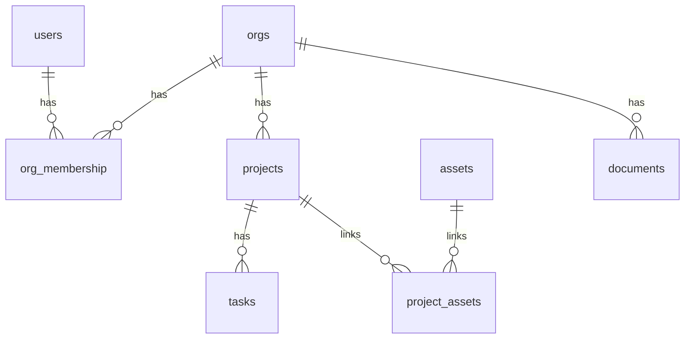
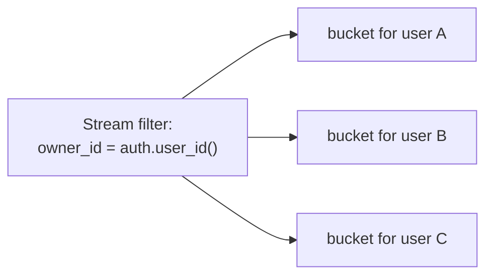
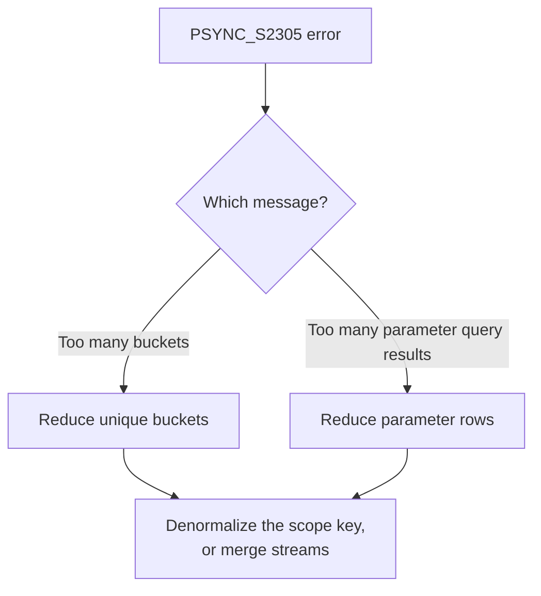

PowerSync groups the rows a client syncs into internal partitions called buckets. Every user has a limit on how many buckets they can sync, and some query shapes create more buckets than others. This page explains how streams turn into buckets, how to count them, how to read the limits, and how to bring a high count back down.

If you have hit a `PSYNC_S2305` error, jump to [Diagnosing High Bucket Count](#diagnosing-high-bucket-count).

## What Is a Bucket?

A bucket is a group of rows that PowerSync syncs together as one unit. When you define a stream, PowerSync splits the matching rows into buckets so it can sync each client the exact subset of data it needs. You do not create or name buckets yourself. PowerSync creates them for you based on your stream queries.

For the wider picture of why buckets exist and how they make sync efficient, see [Bucket System](/architecture/powersync-service#bucket-system). This page focuses understanding how many buckets does your configuration create, and how do you keep that number under control.

## The Example App

Every example on this page uses the same app. It has organizations, projects, tasks, assets, and documents.



Here is how the tables relate:

- A user belongs to one or more organizations. The `org_membership` table links a `user_id` to an `org_id`.
- Each project belongs to one organization through `org_id`. Each project also has a plain text `region` column such as `us-east`.
- Each task belongs to one project through `project_id`.
- Projects and assets link through the `project_assets` table.
- Each document has an `owner_id`, a `shared_with` user, and an `org_id`.
- The `categories` table is shared reference data. It has no owner and no links to the other tables, so it does not appear in the diagram above.

## How Sync Streams Create Buckets

### The Bucket Rule

The rule is simple. A stream creates **one bucket for each unique value of its filter**.

Take this stream:

```yaml
streams:
  my_documents:
    query: SELECT * FROM documents WHERE owner_id = auth.user_id()
```

The filter is `owner_id = auth.user_id()`. Each user has one user ID, so each user gets one bucket. The value that separates one bucket from the next is called the bucket's *parameter*.

The filter value can come from several places. Each unique value still becomes its own bucket:



### Buckets Are Counted Per Stream

PowerSync does not share buckets between streams. Two streams that select the same data still create separate buckets. Each stream adds its own buckets to the user's total. To combine data that shares a filter, put it in one stream with [multiple queries](/sync/streams/queries#multiple-queries-per-stream) instead of several streams.

### Reading a Bucket Name

Bucket names appear in your instance logs. A bucket name has three parts. For example: `5#my_documents|0["ef718ff3..."]`.

- `5#` is the storage version.
- `my_documents|0` is the stream name with an internal index.
- `["ef718ff3..."]` is the parameter value for the bucket.

<Note>
The exact bucket name format can change between releases. Use it to read logs. Do not depend on it in your application code.
</Note>

## Counting Buckets by Query Pattern

Each stream below creates a set number of buckets per user. Work through them one at a time. The pattern you use decides the count.

### No Parameters: One Global Bucket

```yaml
streams:
  categories:
    query: SELECT * FROM categories
```

This stream has no filter. It creates one bucket. Every user syncs that same bucket. Global data uses one bucket, however many users you have.

**Count: 1 bucket, shared by all users.**

### A Direct Auth Filter: One Bucket Per User

```yaml
streams:
  my_memberships:
    query: SELECT * FROM org_membership WHERE user_id = auth.user_id()
```

The filter is one value: the user's ID. Each user has one ID, so each user gets one bucket.

**Count: 1 bucket per user.**

### A JWT Array: One Bucket Per Value

```yaml
streams:
  my_orgs:
    query: SELECT * FROM orgs WHERE id IN auth.parameter('org_ids')
```

The user's JWT holds a list of org IDs, such as `["org-a", "org-b", "org-c"]`. PowerSync makes one bucket for each value in the list.

**Count: one bucket per org ID in the token.**

### A Subscription Parameter: One Bucket Per Subscription

```yaml
streams:
  project_tasks:
    query: SELECT * FROM tasks WHERE project_id = subscription.parameter('project_id')
```

The client picks a project and subscribes with its ID. PowerSync makes one bucket for each project the client subscribes to. If the client opens three projects, it uses three buckets.

**Count: one bucket per project the client subscribes to.**

### A Subquery: One Bucket Per Result Row

```yaml
streams:
  org_projects:
    with:
      user_orgs: SELECT org_id FROM org_membership WHERE user_id = auth.user_id()
    query: SELECT * FROM projects WHERE org_id IN user_orgs
```

The `user_orgs` filter returns the user's org IDs. The query keys on `org_id`, which is a column on `projects`. PowerSync makes one bucket for each org the user belongs to. All projects in the same org share one bucket.

**Count: one bucket per org the user belongs to.**

### A JOIN Through Another Table: One Bucket Per Joined Row

```yaml
streams:
  org_tasks:
    with:
      user_orgs: SELECT org_id FROM org_membership WHERE user_id = auth.user_id()
    query: |
      SELECT tasks.* FROM tasks
      JOIN projects ON tasks.project_id = projects.id
      WHERE projects.org_id IN user_orgs
```

This stream syncs tasks, but tasks have no `org_id`. They only have `project_id`. A bucket's key must be a column on the table you sync (see [The Partition Key Must Exist on the Row](#the-partition-key-must-exist-on-the-row)). So PowerSync keys these buckets on `project_id`, not `org_id`. It makes one bucket for each project.

Compare this to the subquery above. That stream syncs `projects`, which has `org_id`, so it keys on org. This stream syncs `tasks`, which only has `project_id`, so it keys on project. The table you sync decides the key.

**Count: one bucket per project.**

### A Many-to-Many JOIN: One Bucket Per Row You Select

```yaml
streams:
  my_assets:
    with:
      user_projects: SELECT id FROM projects WHERE org_id IN (SELECT org_id FROM org_membership WHERE user_id = auth.user_id())
    query: |
      SELECT assets.* FROM assets
      JOIN project_assets ON project_assets.asset_id = assets.id
      WHERE project_assets.project_id IN user_projects
```

This is the pattern that surprises people. The join links assets to projects through `project_assets`. But you select from `assets`, and the join keys on `assets.id`. So PowerSync makes one bucket per asset, not one per project. A user with 2,000 assets gets 2,000 buckets.

**Count: one bucket per asset.**

<Note>
The subquery, JOIN, and many-to-many examples above each run a *parameter lookup* to find the values to key on. The rows a lookup returns count toward a second limit, the parameter query results limit, which is separate from the bucket limit. For example, if a user belongs to 1,200 orgs, the `org_projects` lookup returns 1,200 rows, which is over the default limit of 1,000, and the sync fails. See [Limits](#limits) to learn how the two limits differ.
</Note>

## How Bucket Counts Combine

### Two Filters Multiply

Write a stream with two filters. This one syncs the user's projects, but only in a region the client picks:

```yaml
streams:
  projects_by_region:
    with:
      user_orgs: SELECT org_id FROM org_membership WHERE user_id = auth.user_id()
    query: |
      SELECT * FROM projects
      WHERE org_id IN user_orgs
        AND region = subscription.parameter('region')
```

This stream filters on two things. The first is the user's orgs. The second is a region the client subscribes with. PowerSync makes one bucket for each pair of (org, region).

Say the user has 3 orgs and subscribes to 2 regions. That is 3 × 2 = 6 buckets. Two filters multiply. They do not add.

### Chained Queries Add Each Level

Now chain two levels. This stream syncs the user's orgs, their projects, and their tasks:

```yaml
streams:
  org_data:
    auto_subscribe: true
    with:
      user_orgs:     SELECT org_id FROM org_membership WHERE user_id = auth.user_id()
      user_projects: SELECT id FROM projects WHERE org_id IN (SELECT org_id FROM org_membership WHERE user_id = auth.user_id())
    queries:
      - SELECT * FROM orgs     WHERE id         IN user_orgs
      - SELECT * FROM projects WHERE id         IN user_projects
      - SELECT * FROM tasks    WHERE project_id IN user_projects
```

Say the user has 2 orgs and 6 projects. Follow the buckets one query at a time:

- The `orgs` query keys on org. The user has 2 orgs, so it makes 2 buckets.
- The `projects` query keys on project. The user has 6 projects, so it makes 6 buckets.
- The `tasks` query also keys on project. It uses the same 6 projects, so it shares those buckets and adds 0.

That is 2 + 6 = 8 buckets.

Queries in one stream share buckets only when they key on the same value. The `orgs` query keys on org, so its buckets do not merge with the project buckets. Each new level adds more buckets. With 10 orgs and 50 projects each, this stream makes 10 + 500 = 510 buckets.

### Multiple Queries in One Stream Share Buckets

Queries in the same stream that filter the same way share one bucket per value. Put related tables in one stream to keep the count low:

```yaml
streams:
  org_overview:
    with:
      user_orgs: SELECT org_id FROM org_membership WHERE user_id = auth.user_id()
    queries:
      - SELECT * FROM orgs     WHERE id     IN user_orgs
      - SELECT * FROM projects WHERE org_id IN user_orgs
```

Both queries key on the user's orgs. They share one bucket per org. Say the user has 3 orgs. This stream makes 3 buckets, not 6.

### Global CTEs Count Per Stream

A global CTE lets you write filtering logic once and use it in many streams. It does not share buckets between those streams. Each stream runs the CTE on its own and makes its own buckets.

```yaml
config:
  edition: 3

with:
  user_orgs: SELECT org_id FROM org_membership WHERE user_id = auth.user_id()

streams:
  my_orgs:
    query: SELECT * FROM orgs WHERE id IN user_orgs
  org_projects:
    query: SELECT * FROM projects WHERE org_id IN user_orgs
```

Both streams use the same `user_orgs` CTE. But they are separate streams, so they do not share buckets. Say the user has 3 orgs. The `my_orgs` stream makes 3 buckets. The `org_projects` stream makes 3 more. That is 6 buckets, not 3.

Use a global CTE to keep your config readable. To share buckets, put the queries in one stream, as shown above.

### OR Conditions Expand

An `OR` in a filter splits into parts. Take this stream:

```yaml
streams:
  my_documents:
    query: SELECT * FROM documents WHERE owner_id = auth.user_id() OR shared_with = auth.user_id()
```

The filter has an `OR`. PowerSync splits it into two parts: documents you own, and documents shared with you. Each part makes its own bucket. So this stream makes 2 buckets per user, not 1.

PowerSync rewrites `A AND (B OR C)` into `(A AND B) OR (A AND C)`. A shared part like `A` runs in each part. If `A` is a subquery or a parameter lookup, its rows count again in each part. Keep `OR` out of filters that use subqueries or parameters where you can.

<Warning>
Two compile-time limits protect you from runaway expansion. A single stream can define at most 100 buckets. A single filter can expand to at most 100 `OR` terms. If you exceed either, the deploy fails with an error. Move nested `OR` conditions into separate queries to stay under both.
</Warning>

## Limits

PowerSync limits how much a single user can sync. There are **two** limits. Both default to 1,000. And they both raise the same error, `PSYNC_S2305`. However, They measure different things, here's how to understand both.

| Limit | What it counts | Global buckets counted? |
|---|---|---|
| Buckets per connection | The unique buckets for one connection, after PowerSync removes duplicates | Yes |
| Parameter query results | The rows your parameter lookups return, before duplicates are removed, added up across all lookups in one sync | No |

### Buckets Per Connection

This limit counts the unique buckets a user syncs. PowerSync removes duplicate buckets before it counts. Global buckets count toward this limit. When a user exceeds it, the log shows:

```text
Too many buckets: 1200 (limit of 1000)
```

### Parameter Query Results

Some filters need a lookup to find the values to key on. A subquery, a CTE, or a JWT array each produces a list of values, such as the org IDs a user belongs to. This is a *parameter lookup*. The values it returns are *parameter query results*.

This limit counts those result rows. It counts them for one user, across every stream that user subscribes to, added together. It counts them *before* PowerSync removes duplicates. Global buckets use no lookup, so they do not count toward this limit.

The limit applies to the values that define buckets, not to the number of data rows synced. A separate, much higher limit controls how many data rows a client can sync (see [Performance and Limits](/resources/performance-and-limits)). So a limit of 1,000 means up to 1,000 bucket-defining values per user.

When a user exceeds it, the log shows:

```text
Too many parameter query results (limit of 1000)
```

### Why the Two Counts Differ

The two limits measure different things, so they are usually different numbers. A stream can produce a small set of unique buckets from a large number of parameter rows. In that case you reach the parameter limit first. A config with many global buckets can reach the bucket limit first.

This is why a checkpoint log can read `buckets: 7 | param_results: 6`. One global bucket adds to the bucket count but not to the parameter count.

<Warning>
The parameter limit can stop a sync while the bucket count still looks safe. A user can fail with far fewer than 1,000 buckets, because their parameter lookups returned more than 1,000 rows. Always check both numbers.
</Warning>

### Sync Rules Compared to Sync Streams

If you are moving from legacy [Sync Rules](/sync/rules/overview), this distinction is new. In Sync Rules, the two limits were effectively the same number: each parameter-query result became one bucket, so the counts matched. In [Sync Streams](/sync/streams/overview), queries can produce buckets and parameter rows at different rates, so the two limits can diverge.

## Diagnosing High Bucket Count

### Reading the Error Message First

The `PSYNC_S2305` message tells you which limit you reached. The fix is different for each, so read it first.

- `Too many buckets` means you reached the bucket limit. Reduce the number of unique buckets.
- `Too many parameter query results` means you reached the parameter limit. Reduce the number of rows your parameter lookups return.



### The Contributor Breakdown

The `PSYNC_S2305` log includes a breakdown of the streams that contribute the most.

- For a bucket-limit error, it lists streams by bucket count, highest first.
- For a parameter-limit error, it lists the streams that returned the most rows, and then the stream that reached zero budget. Each listed stream shows how many rows it returned. The failing stream instead shows how much budget was left when it failed.

<Warning>
For a parameter-limit error, the last stream in the breakdown is the one that ran when the budget reached zero. This stream is not always the cause. PowerSync adds up parameter results across streams in order. The last stream is only the one that crossed the line. Check every stream in the breakdown, not just the last one.
</Warning>

### Checkpoint Logs

Checkpoint logs record the counts for each connection. Find them in your [instance logs](/maintenance-ops/monitoring-and-alerting). For example:

```text
New checkpoint: 800178 | write: null | buckets: 7 | param_results: 6 ["5#org_data|0[\"ef718ff3...\"]","5#org_data|1[\"1ddeddba...\"]", ...]
```

- `buckets` is the number of unique buckets for this connection.
- `param_results` is the total number of parameter rows for this connection.
- The array lists the bucket names. Each name already includes its parameter value. The list stops after 20 names.

### Sync Diagnostics Client

The [Sync Diagnostics Client](/tools/diagnostics-client) shows the buckets for one user. It does not load for a user who is over the limit, because that user's sync fails before the data loads. Use the instance logs and the error breakdown for those users. The client shows the bucket count, which may not be the limit you reached. Confirm the limit from the error message.

## Reducing Bucket Count

Start with the strategy that matches your query shape. Most high counts come from hierarchical or many-to-many data, where denormalizing the scope key gives the biggest reduction.

<AccordionGroup>

<Accordion title="Consolidate streams using multiple queries per stream">

Use `queries` instead of separate streams to group related tables. All queries in a stream that filter the same way share one bucket per value. See [multiple queries per stream](/sync/streams/queries#multiple-queries-per-stream).

**Before**: 5 separate streams, each with a direct `auth.user_id()` filter, create 5 buckets per user:

```yaml
streams:
  user_settings:
    query: SELECT * FROM settings WHERE user_id = auth.user_id()
  user_prefs:
    query: SELECT * FROM preferences WHERE user_id = auth.user_id()
  user_org_list:
    query: SELECT * FROM org_membership WHERE user_id = auth.user_id()
  user_region:
    query: SELECT * FROM region_members WHERE user_id = auth.user_id()
  user_profile:
    query: SELECT * FROM profiles WHERE user_id = auth.user_id()
```

**After**: 1 stream with 5 queries creates 1 bucket per user:

```yaml
streams:
  user_data:
    queries:
      - SELECT * FROM settings WHERE user_id = auth.user_id()
      - SELECT * FROM preferences WHERE user_id = auth.user_id()
      - SELECT * FROM org_membership WHERE user_id = auth.user_id()
      - SELECT * FROM region_members WHERE user_id = auth.user_id()
      - SELECT * FROM profiles WHERE user_id = auth.user_id()
```

</Accordion>

<Accordion title="Denormalize the scope key for hierarchical data">

This is the most effective fix for parent-child data. When chained queries through org → project → task create too many buckets, filter every table with the same top-level parameter, such as `org_id`. A bucket's key must be a column on the table you sync (see [Edge Cases](#the-partition-key-must-exist-on-the-row) below). So this works only if the child tables have that column. If tasks only have `project_id`, add `org_id` to the tasks table.

**Before**: chained queries create 10 + 500 = 510 buckets for 10 orgs with 50 projects each. Projects and tasks share buckets because they use the same filter. Orgs use a different filter, so they add their own buckets:

```yaml
streams:
  org_projects_tasks:
    with:
      user_orgs: SELECT org_id FROM org_membership WHERE user_id = auth.user_id()
      user_projects: SELECT id FROM projects WHERE org_id IN (SELECT org_id FROM org_membership WHERE user_id = auth.user_id())
    queries:
      - SELECT * FROM orgs WHERE id IN user_orgs
      - SELECT * FROM projects WHERE id IN user_projects
      - SELECT * FROM tasks WHERE project_id IN user_projects
```

**After**: add `org_id` to the tasks table, then filter every table by org. This creates 10 buckets:

```yaml
streams:
  org_projects_tasks:
    with:
      user_orgs: SELECT org_id FROM org_membership WHERE user_id = auth.user_id()
    queries:
      - SELECT * FROM orgs WHERE id IN user_orgs
      - SELECT * FROM projects WHERE org_id IN user_orgs
      - SELECT * FROM tasks WHERE org_id IN user_orgs
```

</Accordion>

<Accordion title="Query the membership table directly instead of through it">

When a subquery or JOIN through a membership table creates N buckets, query the membership table directly with a direct auth filter. Use no subquery and no JOIN. You often need fields from the related table, such as the org name, alongside each membership row. Denormalize those fields onto the membership table so they are available without a JOIN.

**Before**: N org memberships create N buckets:

```yaml
streams:
  org_data:
    query: SELECT * FROM orgs WHERE id IN (SELECT org_id FROM org_membership WHERE user_id = auth.user_id())
```

**After**: 1 bucket per user, with org fields denormalized onto `org_membership`:

```yaml
streams:
  my_org_memberships:
    query: SELECT * FROM org_membership WHERE user_id = auth.user_id()
```

</Accordion>

<Accordion title="Many-to-many via a JSON array column">

A join through a link table creates one bucket per row of the table you select from. For assets linked to projects through `project_assets`, you get one bucket per asset.

Add a denormalized `project_ids` JSON array column to `assets`, maintained with database triggers. Then use `json_each()` to traverse it. This lets PowerSync key the bucket by project ID instead of asset ID.

**Before**: one bucket per asset. 2,000 assets create 2,000 buckets:

```yaml
streams:
  assets_in_projects:
    with:
      user_projects: SELECT id FROM projects WHERE org_id IN (SELECT org_id FROM org_membership WHERE user_id = auth.user_id())
    query: |
      SELECT assets.* FROM assets
      JOIN project_assets ON project_assets.asset_id = assets.id
      WHERE project_assets.project_id IN user_projects
```

**After**: key by project. 50 projects create 50 buckets:

```yaml
streams:
  assets_in_projects:
    with:
      user_projects: SELECT id FROM projects WHERE org_id IN (SELECT org_id FROM org_membership WHERE user_id = auth.user_id())
    query: |
      SELECT assets.* FROM assets
      INNER JOIN json_each(assets.project_ids) AS p
      INNER JOIN user_projects ON p.value = user_projects.id
```

The `INNER JOIN user_projects` syncs only assets that belong to at least one of the user's projects. The bucket key is the project ID, so the count matches the number of projects, not assets.

</Accordion>

<Accordion title="Restructure to use subscription parameters">

Buckets are created per active subscription, not from every possible value. Use `subscription.parameter('project_id')` so the count is bounded by how many subscriptions the client has active.

**Before**: a subquery returns all of the user's projects. 50 projects create 50 buckets:

```yaml
streams:
  project_tasks:
    with:
      user_projects: SELECT id FROM projects WHERE org_id IN (SELECT org_id FROM org_membership WHERE user_id = auth.user_id())
    query: SELECT * FROM tasks WHERE project_id IN user_projects
```

**After**: the client subscribes per project on demand. 3 open projects create 3 buckets:

```yaml
streams:
  project_tasks:
    with:
      user_projects: SELECT id FROM projects WHERE org_id IN (SELECT org_id FROM org_membership WHERE user_id = auth.user_id())
    query: SELECT * FROM tasks WHERE project_id = subscription.parameter('project_id') AND project_id IN user_projects
```

The client subscribes when the user opens a project and unsubscribes when they leave. This works only when the user does not need every record available offline at the same time.

</Accordion>

</AccordionGroup>

## Edge Cases and Gotchas

### The Partition Key Must Exist on the Row

A bucket's key must be a value that physically exists on a row of the table you sync. You cannot split a table into buckets by a column it does not have. This is why denormalizing the scope key onto child tables is the standard fix. If tasks only have `project_id`, you cannot key their buckets by `org_id` until you add `org_id` to the tasks table.

### Subscription Parameters Choose Buckets, They Do Not Re-Partition Them

A subscription parameter lets the client choose which existing buckets to sync. It does not change how those buckets are defined.

For a parameter to select a bucket, its value must match a value on the row being synced. For example, each task has a `project_id`, so you can use that column to group tasks into project buckets:

```yaml
streams:
  project_tasks:
    query: SELECT * FROM tasks WHERE project_id = subscription.parameter('project_id')
```

Assets for example are different. An asset can belong to multiple projects, so the asset row does not have a single `project_id`. Passing a `project_id` as a subscription parameter therefore cannot make PowerSync group those assets by project. The asset row has no project ID to match against.

If you want to sync assets by project, the asset row needs to contain a project reference first. For example, you could add a `project_ids` array column as described in [Reducing Bucket Count](#reducing-bucket-count).

### Correlated Joins Behave Like Subqueries

A correlated JOIN and an `IN (subquery)` compile to the same internal form. They create the same number of buckets. Rewriting one as the other does not reduce the count.

### CTEs Cannot Reference Each Other

Each CTE must be self-contained. A CTE cannot reference another CTE by name. If it does, the deploy fails. Inline the nested subquery instead. See [CTE limitations](/sync/streams/ctes#limitations).

### Global Buckets Multiply Storage and Cost

A stream with no filter creates one global bucket that every user syncs. Under `auto_subscribe: true`, every write to that table fans out to every user. This drives up synced data volume and cost. Scope global buckets carefully, and only mark truly shared reference data as global.

### Bucket Storage Does Not Shrink When You Archive

Buckets are append-only. Marking a row as archived does not remove it from bucket storage on its own. A row leaves storage only when it stops matching the data query, through a hard delete or a filter on the table's own column. Storage reclaims space during [compaction](/maintenance-ops/compacting-buckets). Filtering through a parent table does not shrink a child table's stored data.

### Total Buckets Are Not the Same as Buckets Per User

The 1,000 limit applies to each individual user, not to your whole instance. Your PowerSync Service can track millions of buckets in total, as long as each user syncs fewer than the limit. A large total bucket count is not a problem on its own.

## Increasing the Limit

Raise the limit only after you exhaust the reduction strategies above.

Before you raise it, weigh the cost. Sync overhead scales roughly linearly with the number of buckets per user. Doubling the bucket count roughly doubles sync latency for a single operation. It also roughly doubles CPU and memory use on the server and the client. Many operations inside a single bucket scale much more efficiently than many buckets. The 1,000 default exists to encourage fewer, larger buckets and to protect the service from excessive counts.

On PowerSync Cloud, you can request a higher limit on [Team and Enterprise](https://www.powersync.com/pricing) plans, up to 10,000. The limit applies per user, so your instance can still track far more buckets in total.

For self-hosted deployments, set the limits under `api.parameters`:

```yaml service.yaml
api:
  parameters:
    max_buckets_per_connection: 5000
    max_parameter_query_results: 5000
```

Set both. Raising one without the other still leaves you capped by the limit you did not change.

## Related Pages

- [Writing Queries](/sync/streams/queries) covers the query syntax that determines your bucket count.
- [Common Table Expressions (CTEs)](/sync/streams/ctes) covers shared filtering logic.
- [Using Parameters](/sync/streams/parameters) covers auth, subscription, and connection parameters.
- [Examples, Patterns & Demos](/sync/streams/examples) covers real-world stream shapes.
- [Bucket System](/architecture/powersync-service#bucket-system) covers how buckets work internally.
- [Troubleshooting](/debugging/troubleshooting#too-many-buckets-psync_s2305) covers the `PSYNC_S2305` error.
- [Performance and Limits](/resources/performance-and-limits) lists the Service limits.
