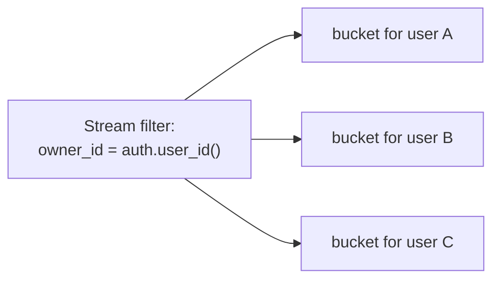

import BucketCountExampleApp from '/snippets/bucket-count-example-app.mdx';

PowerSync groups the rows a client syncs into internal partitions called buckets. Every user has a limit on how many buckets they can sync, and some query patterns create more buckets than others. This page explains how Sync Streams turn into buckets, how to count them, and how to read the limits.

Already syncing too many buckets, or hit a `PSYNC_S2305` error? See [Reducing Bucket Count](/sync/streams/reducing-bucket-count) to diagnose and fix it.

## What Is a Bucket?

A bucket is a group of rows that PowerSync syncs together as one unit. When you define a Sync Stream, PowerSync splits the matching rows into buckets so it can sync each client the exact subset of data it needs. You do not create or name buckets yourself. PowerSync creates them for you based on your stream queries.

For the wider picture of why buckets exist and how they make sync efficient, see [Bucket System](/architecture/powersync-service#bucket-system). This page focuses on understanding how many buckets your configuration creates and how to keep that number under control.

<BucketCountExampleApp />

## How Sync Streams Create Buckets

### The Bucket Rule

The rule is simple. A stream creates **one bucket for each unique value of its filter**.

Take this stream:

```yaml
streams:
  my_documents:
    query: SELECT * FROM documents WHERE owner_id = auth.user_id()
```

The filter is `owner_id = auth.user_id()`. Each user has one user ID, so each user gets one bucket. The value that separates one bucket from the next is called the bucket's *parameter*.

The filter value can come from several places. Each unique value still becomes its own bucket:



### Buckets Are Counted Per Stream

PowerSync does not share buckets between streams. Two streams that select the same data still create separate buckets. Each stream adds its own buckets to the user's total. To combine data that shares a filter, put it in one stream with [multiple queries](/sync/streams/queries#multiple-queries-per-stream) instead of several streams.

### Reading a Bucket Name

Bucket names appear in your instance logs. A bucket name has three parts. For example: `5#my_documents|0["ef718ff3..."]`.

- `5#` is the storage version.
- `my_documents|0` is the stream name with an internal index.
- `["ef718ff3..."]` is the parameter value for the bucket.

<Note>
The exact bucket name format can change between releases. Use it to read logs. Do not depend on it in your application code.
</Note>

## Counting Buckets by Query Pattern

Each stream below creates a set number of buckets per user. Work through them one at a time. The pattern you use decides the count.

### No Parameters: One Global Bucket

```yaml
streams:
  categories:
    query: SELECT * FROM categories
```

This stream has no filter. It creates one bucket. Every user syncs that same bucket. Global data uses one bucket, however many users you have.

**Count: 1 bucket, shared by all users.**

### A Direct Auth Filter: One Bucket Per User

```yaml
streams:
  my_memberships:
    query: SELECT * FROM org_membership WHERE user_id = auth.user_id()
```

The filter is one value: the user's ID. Each user has one ID, so each user gets one bucket.

**Count: 1 bucket per user.**

### A JWT Array: One Bucket Per Value

```yaml
streams:
  my_orgs:
    query: SELECT * FROM orgs WHERE id IN auth.parameter('org_ids')
```

The user's JWT holds a list of org IDs, such as `["org-a", "org-b", "org-c"]`. PowerSync makes one bucket for each value in the list.

**Count: one bucket per org ID in the token.**

### A Subscription Parameter: One Bucket Per Subscription

```yaml
streams:
  project_tasks:
    query: SELECT * FROM tasks WHERE project_id = subscription.parameter('project_id')
```

The client picks a project and subscribes with its ID. PowerSync makes one bucket for each project the client subscribes to. If the client opens three projects, it uses three buckets.

**Count: one bucket per project the client subscribes to.**

### A Subquery: One Bucket Per Result Row

```yaml
streams:
  org_projects:
    with:
      user_orgs: SELECT org_id FROM org_membership WHERE user_id = auth.user_id()
    query: SELECT * FROM projects WHERE org_id IN user_orgs
```

The `user_orgs` filter returns the user's org IDs. The query keys on `org_id`, which is a column on `projects`. PowerSync makes one bucket for each org the user belongs to. All projects in the same org share one bucket.

**Count: one bucket per org the user belongs to.**

### A JOIN Through Another Table: One Bucket Per Joined Row

```yaml
streams:
  org_tasks:
    with:
      user_orgs: SELECT org_id FROM org_membership WHERE user_id = auth.user_id()
    query: |
      SELECT tasks.* FROM tasks
      JOIN projects ON tasks.project_id = projects.id
      WHERE projects.org_id IN user_orgs
```

This stream syncs tasks, but tasks have no `org_id`. They only have `project_id`. A bucket's key must be a column on the table you sync (see [The Partition Key Must Exist on the Row](/sync/streams/reducing-bucket-count#the-partition-key-must-exist-on-the-row)). So PowerSync keys these buckets on `project_id`, not `org_id`. It makes one bucket for each project.

Compare this to the subquery above. That stream syncs `projects`, which has `org_id`, so it keys on org. This stream syncs `tasks`, which only has `project_id`, so it keys on project. The table you sync decides the key.

**Count: one bucket per project.**

### A Many-to-Many JOIN: One Bucket Per Row You Select

```yaml
streams:
  my_assets:
    with:
      user_projects: SELECT id FROM projects WHERE org_id IN (SELECT org_id FROM org_membership WHERE user_id = auth.user_id())
    query: |
      SELECT assets.* FROM assets
      JOIN project_assets ON project_assets.asset_id = assets.id
      WHERE project_assets.project_id IN user_projects
```

This is the pattern that surprises people. The join links assets to projects through `project_assets`. But you select from `assets`, and the join keys on `assets.id`. So PowerSync makes one bucket per asset, not one per project. A user with 2,000 assets gets 2,000 buckets.

**Count: one bucket per asset.**

<Note>
The subquery, JOIN, and many-to-many examples above each run a *parameter lookup* to find the values to key on. The rows a lookup returns count toward a second limit, the parameter query results limit, which is separate from the bucket limit. For example, if a user belongs to 1,200 orgs, the `org_projects` lookup returns 1,200 rows, which is over the default limit of 1,000, and the sync fails. See [Limits](#limits) to learn how the two limits differ.
</Note>

## How Bucket Counts Combine

Real streams often combine more than one filter. These examples show how the counts stack up, so you can spot the patterns that grow fastest.

### Two Filters Multiply

Write a stream with two filters. This one syncs the user's projects, but only in a region the client picks:

```yaml
streams:
  projects_by_region:
    with:
      user_orgs: SELECT org_id FROM org_membership WHERE user_id = auth.user_id()
    query: |
      SELECT * FROM projects
      WHERE org_id IN user_orgs
        AND region = subscription.parameter('region')
```

This stream filters on two things. The first is the user's orgs. The second is a region the client subscribes with. PowerSync makes one bucket for each pair of (org, region).

Say the user has 3 orgs and subscribes to 2 regions. That is 3 × 2 = 6 buckets. Two filters multiply. They do not add.

### Chained Queries Add Each Level

Now chain two levels. This stream syncs the user's orgs, their projects, and their tasks:

```yaml
streams:
  org_data:
    auto_subscribe: true
    with:
      user_orgs:     SELECT org_id FROM org_membership WHERE user_id = auth.user_id()
      user_projects: SELECT id FROM projects WHERE org_id IN (SELECT org_id FROM org_membership WHERE user_id = auth.user_id())
    queries:
      - SELECT * FROM orgs     WHERE id         IN user_orgs
      - SELECT * FROM projects WHERE id         IN user_projects
      - SELECT * FROM tasks    WHERE project_id IN user_projects
```

Say the user has 2 orgs and 6 projects. Follow the buckets one query at a time:

- The `orgs` query keys on org. The user has 2 orgs, so it makes 2 buckets.
- The `projects` query keys on project. The user has 6 projects, so it makes 6 buckets.
- The `tasks` query also keys on project. It uses the same 6 projects, so it shares those buckets and adds 0.

That is 2 + 6 = 8 buckets.

Queries in one stream share buckets only when they key on the same value. The `orgs` query keys on org, so its buckets do not merge with the project buckets. Each new level adds more buckets. With 10 orgs and 50 projects each, this stream makes 10 + 500 = 510 buckets.

### Multiple Queries in One Stream Share Buckets

Queries in the same stream that filter the same way share one bucket per value. Put related tables in one stream to keep the count low:

```yaml
streams:
  org_overview:
    with:
      user_orgs: SELECT org_id FROM org_membership WHERE user_id = auth.user_id()
    queries:
      - SELECT * FROM orgs     WHERE id     IN user_orgs
      - SELECT * FROM projects WHERE org_id IN user_orgs
```

Both queries key on the user's orgs. They share one bucket per org. Say the user has 3 orgs. This stream makes 3 buckets, not 6.

### Global CTEs Count Per Stream

A global CTE lets you write filtering logic once and use it in many streams. It does not share buckets between those streams. Each stream runs the CTE on its own and makes its own buckets.

```yaml
config:
  edition: 3

with:
  user_orgs: SELECT org_id FROM org_membership WHERE user_id = auth.user_id()

streams:
  my_orgs:
    query: SELECT * FROM orgs WHERE id IN user_orgs
  org_projects:
    query: SELECT * FROM projects WHERE org_id IN user_orgs
```

Both streams use the same `user_orgs` CTE. But they are separate streams, so they do not share buckets. Say the user has 3 orgs. The `my_orgs` stream makes 3 buckets. The `org_projects` stream makes 3 more. That is 6 buckets, not 3.

Use a global CTE to keep your config readable. To share buckets, put the queries in one stream, as shown above.

### OR Conditions Expand

An `OR` in a filter splits into parts. Take this stream:

```yaml
streams:
  my_documents:
    query: SELECT * FROM documents WHERE owner_id = auth.user_id() OR shared_with = auth.user_id()
```

The filter has an `OR`. PowerSync splits it into two parts: documents you own, and documents shared with you. Each part makes its own bucket. So this stream makes 2 buckets per user, not 1.

PowerSync rewrites `A AND (B OR C)` into `(A AND B) OR (A AND C)`. A shared part like `A` runs in each part. If `A` is a subquery or a parameter lookup, its rows count again in each part. Keep `OR` out of filters that use subqueries or parameters where you can.

<Warning>
Two compile-time limits protect you from runaway expansion. A single stream can define at most 100 buckets. A single filter can expand to at most 100 `OR` terms. If you exceed either, the deploy fails with an error. Move nested `OR` conditions into separate queries to stay under both.
</Warning>

## Limits

PowerSync limits how much a single user can sync. There are **two** limits. Both default to 1,000, and both raise the same error, `PSYNC_S2305`. They measure different things, so you need to understand both.

| Limit | What it counts | Global buckets counted? |
|---|---|---|
| Buckets per connection | The unique buckets for one connection, after PowerSync removes duplicates | Yes |
| Parameter query results | The rows your parameter lookups return, before duplicates are removed, added up across all lookups in one sync | No |

### Buckets Per Connection

This limit counts the unique buckets a user syncs. PowerSync removes duplicate buckets before it counts. Global buckets count toward this limit. When a user exceeds it, the log shows:

```text
Too many buckets: 1200 (limit of 1000)
```

### Parameter Query Results

Some filters need a lookup to find the values to key on. A subquery, a CTE, or a JWT array each produces a list of values, such as the org IDs a user belongs to. This is a *parameter lookup*. The values it returns are *parameter query results*.

This limit counts those result rows. It counts them for one user, across every stream that user subscribes to, added together. It counts them *before* PowerSync removes duplicates. Global buckets use no lookup, so they do not count toward this limit.

The limit applies to the values that define buckets, not to the number of data rows synced. A separate, much higher limit controls how many data rows a client can sync (see [Performance and Limits](/resources/performance-and-limits)). So a limit of 1,000 means up to 1,000 bucket-defining values per user.

When a user exceeds it, the log shows:

```text
Too many parameter query results (limit of 1000)
```

### Why the Two Counts Differ

The two limits measure different things, so they are usually different numbers. A stream can produce a small set of unique buckets from a large number of parameter rows. In that case you reach the parameter limit first. A config with many global buckets can reach the bucket limit first.

This is why a checkpoint log can read `buckets: 7 | param_results: 6`. One global bucket adds to the bucket count but not to the parameter count.

<Warning>
The parameter limit can stop a sync while the bucket count still looks safe. A user can fail with far fewer than 1,000 buckets, because their parameter lookups returned more than 1,000 rows. Always check both numbers.
</Warning>

<Note>
In legacy [Sync Rules](/sync/rules/overview), these two limits were effectively one number, because each parameter-query result became one bucket. In Sync Streams they can diverge.
</Note>

### Total Buckets vs Buckets Per User

The 1,000 limit applies to each individual user, not to your whole instance. Your PowerSync Service can track millions of buckets in total, as long as each user syncs fewer than the limit. A large total bucket count is not a problem on its own.

## Related Pages

- [Reducing Bucket Count](/sync/streams/reducing-bucket-count) diagnoses and fixes a high bucket count.
- [Writing Queries](/sync/streams/queries) covers the query syntax that determines your bucket count.
- [Common Table Expressions (CTEs)](/sync/streams/ctes) covers shared filtering logic.
- [Using Parameters](/sync/streams/parameters) covers auth, subscription, and connection parameters.
- [Examples, Patterns & Demos](/sync/streams/examples) covers real-world stream shapes.
- [Bucket System](/architecture/powersync-service#bucket-system) covers how buckets work internally.
- [Performance and Limits](/resources/performance-and-limits) lists the Service limits.
