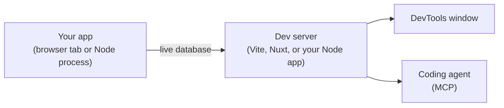

PowerSync DevTools shows what your app's PowerSync client is doing while you develop. You can see the sync status, buckets, Sync Streams, the local SQLite data, the schema, and the logs. You can also run SQL and sync actions.

Coding agents can read the same data through [MCP tools](/tools/devtools/mcp). The MCP tools are available with Vite, Nuxt DevTools 4, and Node.js.

DevTools runs in development only. It adds nothing to a production build.

<Frame caption="PowerSync DevTools in the Vite DevTools dock.">
  
</Frame>

## How It Works

Your dev server serves DevTools. For a Node app, your app process serves it. You do not start a separate tool.

DevTools reads from the database that your app has open. It shows the same data that your app sees.

## Choose Your Environment

<CardGroup cols={2}>
  <Card title="Vite" icon="bolt" href="/tools/devtools/vite">
    React, Vue, Svelte, or any web app that uses Vite 7 or 8.
  </Card>
  <Card title="Nuxt" icon="vuejs" href="/tools/devtools/nuxt">
    Nuxt apps that use `@powersync/nuxt` with Nuxt DevTools 3 or 4.
  </Card>
  <Card title="Node.js" icon="node-js" href="/tools/devtools/node">
    Node.js apps that use `@powersync/node`.
  </Card>
  <Card title="Dart & Flutter" icon="flutter" href="/tools/dart-devtools-extension">
    Flutter and Dart apps, in Dart & Flutter DevTools.
  </Card>
</CardGroup>

<Info>
Support for more platforms is under consideration. To ask for a specific integration, submit an idea or vote for it on the [PowerSync Roadmap](https://roadmap.powersync.com).
</Info>

## Use DevTools

<CardGroup cols={2}>
  <Card title="Using DevTools" icon="table-columns" href="/tools/devtools/using-devtools">
    What each tab shows and which actions you can run.
  </Card>
  <Card title="MCP Tools" icon="robot" href="/tools/devtools/mcp">
    Give a coding agent access to your app's live PowerSync client.
  </Card>
</CardGroup>

## DevTools vs. Sync Diagnostics Client

PowerSync DevTools and the [Sync Diagnostics Client](/tools/diagnostics-client) have different purposes. You can use both.

DevTools connects to your running app. It shows the local SQLite data and the sync state of the client in your app.

The Sync Diagnostics Client connects with a user JWT and the PowerSync endpoint. It shows the data that the Service syncs to that user: tables, rows, operations, buckets, and stream subscriptions.

| | PowerSync DevTools | Sync Diagnostics Client |
|---|---|---|
| **How it connects** | To your running app | With a user JWT and the PowerSync endpoint |
| **What you inspect** | Local SQLite data and sync state in your app | Sync data: buckets, operations, stream subscriptions |
| **Environment** | Development only | Any environment |
| **SDK-specific** | Yes | No. It works with all SDKs. |
